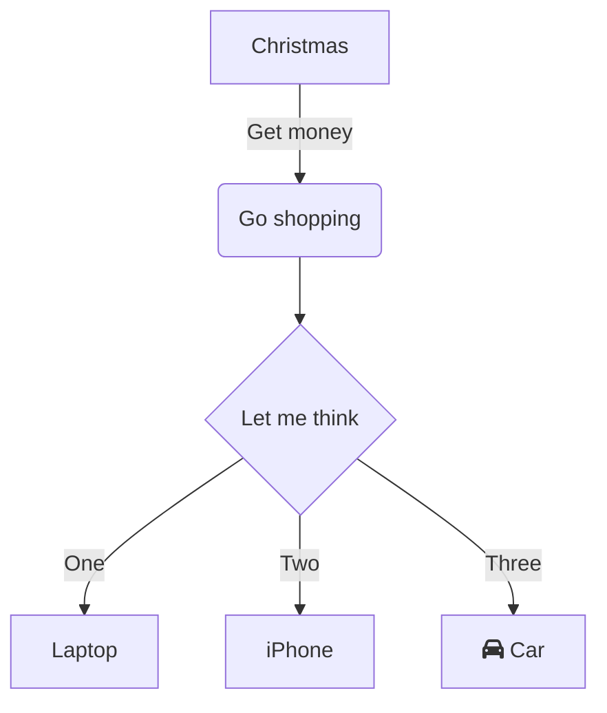
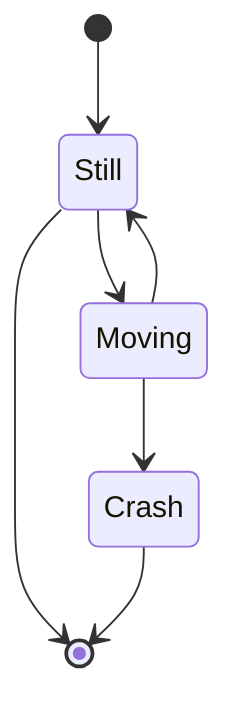
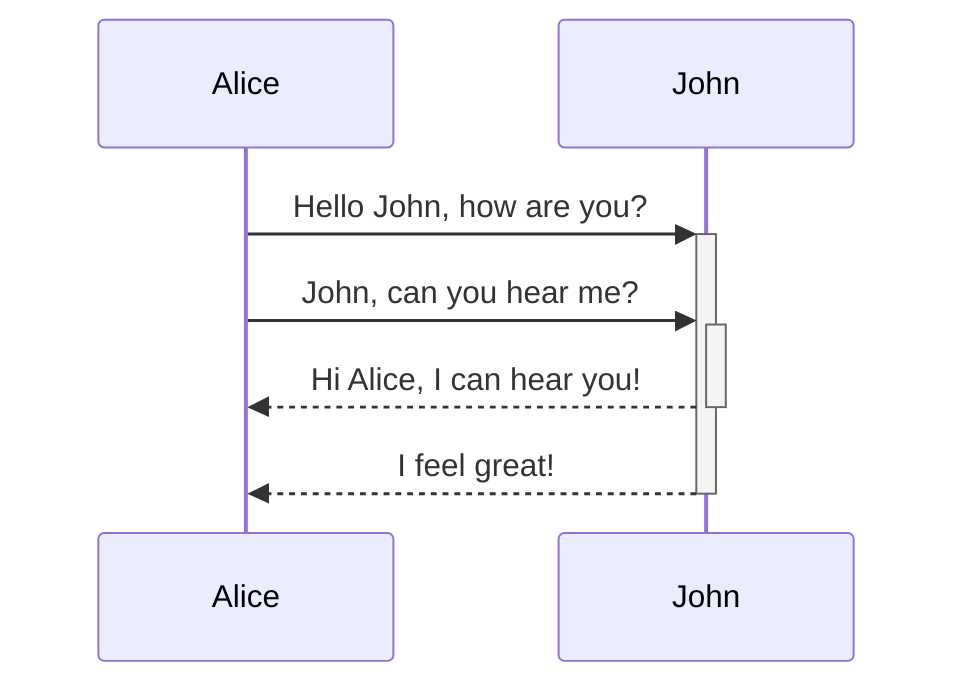
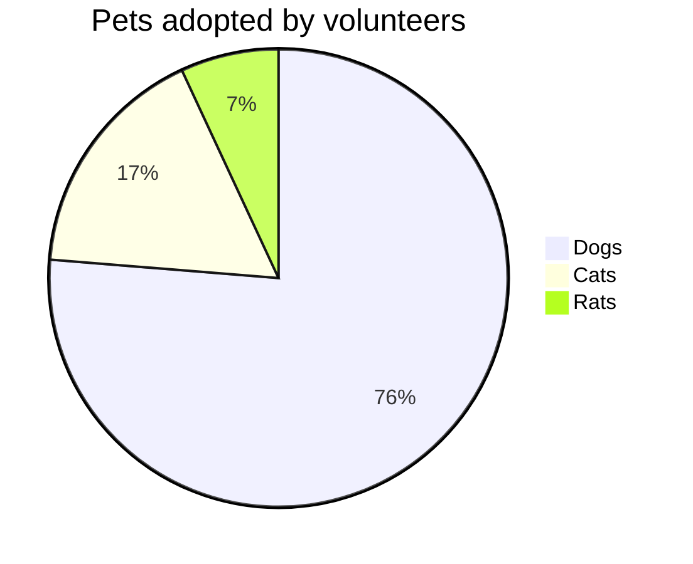

This is the begininning.

I am using the excuse of a personal site to explore the Jekyll opportunity to be used for a static site for technical documentation at work.

# Some html pages to test

- [Pagina template](/template)
- [Prova grafici](/poc_chart)
- [Grafici governi](/gov_chart): durata media di un governo nel tempo.

# How is Markdown rendered?

{:toc}

# h1

## h2

This is a descriptive line

# Another paragraph

- bullet
  - bullet
- bullet

* bullet
  - bullet
* bullet

1. list
   1. list
1. list

## Table

| A   |  B  |   C |
| :-- | :-: | --: |
| 1   |  2  |   3 |

# Mermaid

